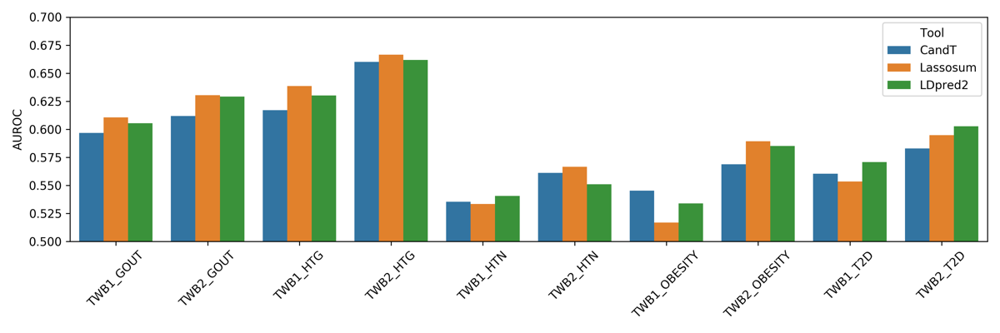

# TWB-PRS

In this repository, we release fourteen polygenic risk score (PRS) models using Taiwan Biobank data, including five binary phenotypes and nine quantitative phenotypes. Each model, derived from the GWAS-PRS analysis, can be used to estimate the genetic propensity for a specific trait at the individual level. Three well-known PRS algorithms are performed to build prediction models, including clumping and thresholding, Lassosum, and LDpred2.

Note that the effect size of SNPs in the PRS model is only used for the accumulation of risk score. The cause of diseases can not be explained via SNPs with high effect size because the relation between the effect size and the pathogenicity is uncertain.


## Dataset

Both Taiwan Biobank 1.0 (TWB1.0) and 2.0 (TWB2.0) are included in this study.

| Dataset | Genome Reference | Sample Size | SNP Number |
| --- | --- | --- | --- |
| TWB1.0 | hg19 | 27,500 | 653,288 |
| TWB2.0 | hg38 | 68,978 | 748,344 |


## Traits

PRS analysis is applied on fourteen traits selected from Taiwan Biobank. Quantitative traits are derived from the measurement directly, while binary traits are labelled using both measurements and self reports.

The distribution plots of quantitative traits are located at [figures/distribution](figures/distribution). Note that only values within &plusmn;5 standard deviation are plotted.

Quantitative traits:
- Height
  - SEX is a very strong factor, so it serves as a covariate during GWAS.
  - Two PRS models are built for male and female respectively.
- Body mass index (BMI)
- Blood pressure: systolic blood pressure (SBP), diastolic blood pressure (DBP)
- Blood lipids: triacelglycerol (TG), low-density lipoprotein (LDL), high-density lipoprotein (HDL)
- Glycated hemoglobin (HbA1c)
- Uric acid

Binary traits:
- Individuals meet the measurement criteria or self report are denoted as positive.
- For analysis, measurement criteria are referred to the diagnostic criteria, though an exact diagnosis should be made by a clinical doctor.
- Criteria:

| Trait | Measurement | Self report |
| --- | --- | --- |
| Obesity | BMI &le; 30 | V |
| Hypertension (HTN) | SBP &le; 140 or DBP &le; 90 | V |
| Hyperlipidemia (HLD) | total cholesterol &le; 200 or TG &le; 150 or LDL &le; 100 | V |
| Type 2 diabetes (T2D) | fasting glucose &le; 126 or HbA1c &le; 6.5 | V |
| Gout | X | V |

- Sample size:

| Trait | TWB1 Case | TWB1 Control | TWB1 Unknown | TWB2 Case | TWB2 Control | TWB2 Unknown |
| --- | --- | --- | --- | --- | --- | --- |
| OBESITY | 25,257 | 2,230 | 13 | 63,932 | 5,042 | 4 | 
| HTN | 20,379 | 7,116 | 5 | 51,991 | 16,972 | 15 | 
| HLD | 4,530 | 22,969 | 1 | 12,743 | 56,232 | 3 | 
| T2D | 24,506 | 2,993 | 1 | 61,804 | 7,171 | 3 | 
| GOUT | 25,887 | 1,612 | 1 | 66,523 | 2,452 | 3 | 


## Pipeline

The PRS pipeline is referred to a comprehensive tutorial by Choi and colleagues.
```
Choi, S. W., Mak, T. S.-H., & O’Reilly, P. F. (2020). Tutorial: A guide to performing polygenic risk score analyses. Nature Protocols, 15(9), 2759–2772. https://doi.org/10.1038/s41596-020-0353-1
```

There are six major steps of the GWAS-PRS analysis pipeline.

1. Train-Test Split: Split the dataset into training and testing sets. The training set is used for training the PRS model while the testing set is used for validating the PRS model.
2. Quality Control: Apply quality control on the training set.
3. Base-Target Split: Split the training set into base and target sets. The base set is used for GWAS analysis while the target set is used for adjusting the effect size of SNPs.
4. GWAS Analysis: Perform genome-wide association studies on the base set to get the P-value and effect size of each SNP.
5. PRS Model: Adjust the effect size of SNPs from GWAS using the target set. For example, select representative SNPs based on the linkage disequilibrium.
6. Validation: Evaluate the performance of PRS models on the testing set.

<p align="center">
  
</p>


## Performance

The Manhattan plot of each trait derived from GWAS is located at [figures/manhattan](figures/manhattan).

Area under the receiver operating characteristic curve (AUROC) and Spearman's correlation are used to evaluate the performance of a binary trait and a quantitative trait respectively.

Performance of the binary trait

<p align="center">
  
</p>

Performance of the quantitative trait

<p align="center">
  
</p>

The quantile plot shows the risk stratification. For each model, samples in the test set are divided into 10 quantiles of increasing PRS. Then, in each quantile, the odds ratio is calculated for binary traits while the mean of values is calculated for quantitative traits. A great difference between the first and the last group represents a good risk stratification. (Quantile plots are located at [figures/quantile](figures/quantile))

Quantile plot of the hyperlipidemia (binary trait)

<p align="center">
  
</p>

Quantile plot of the LDL (quantitative trait)

<p align="center">
  
</p>


## Prediction

PRS prediction of the fourteen traits is available here. Genotype data from the same platform (TWB1.0 or TWB2.0) and population (Taiwanese) are recommended.

#### Package Requirement
- plink1.9, plink2, and python3
- python packages: numpy and pandas

#### Usage
- models/beta.tar.gz has to be pulled with git lfs and extracted before predicting
```
$ bash src/predictor.sh -h

Predict the polygenic risk score for individuals
options:
-i, input bfile prefix
-b, beta file (beta.csv)
-r, reference rank file (rank.csv)
-m, type of the trait; 'clf' (binary) or 'reg' (quantitative)
-d, output directory
-o, output basename
```

#### Example
```
$ bash src/predictor.sh \
    -i example/exp \
    -b models/beta/TWB2_HLD.beta.tsv \
    -r models/rank/TWB2_HLD.rank.csv \
    -m clf \
    -d example/output \
    -o exp
```

## Copyright and Usage
Copyright 2022 NTU c4Lab and Taiwan AI Labs. All rights Reserved.
The released models can only be used for research or education and are not suitable for medical purposes.
